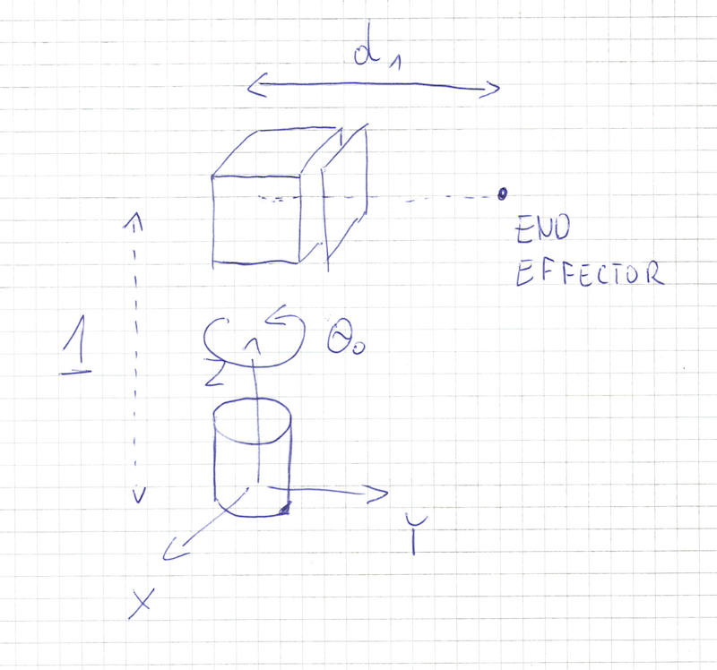
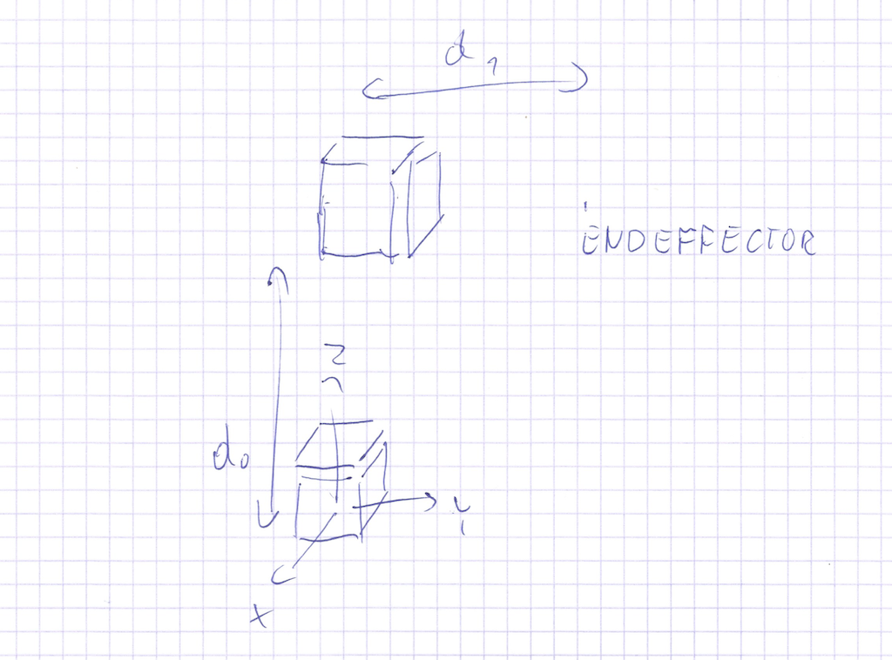

# Lab 11

## Problem 1

## Problem 2

### Task 2-1

Robot has two joints. First joint is revolute, second joint is prismatic with $d >= 0$. Robot base is located at $(0,0,0)$.
Joints are connected by a link of length $1$.
Second joint is rotated around $𝑍$ axis by 90 degrees as in an image below:

When  $𝜃_0=0$ and $𝑑_1=1$ location of end effector wrt base is  (0,1,1) 

Find:

1. Forward kinematics transformation of end effector
2. Workspace of the robot (set of points achievable by end-effector).
3. Inverse kinematics equation in a closed form
4. Write in python program implementing steps 1 and 3.

### Task 2-2

Robot has two prismatic joints with $𝑑 >= 0$. Robot base is located at $(0,0,0)$.
Joints are connected by a link of length 1. Second joint is rotated around $𝑋$ axis by 90 degrees as in an image below:

When $𝑑_0=1$ and  $𝑑_1=1$ location of end effector wrt base is  (0,1,2) 

Find:

1. Forward kinematics transformation of end effector
2. Workspace of the robot (set of points achievable by end-effector).
3. Inverse kinematics equation in a closed form
4. Write in python program implementing steps 1 and 3.
