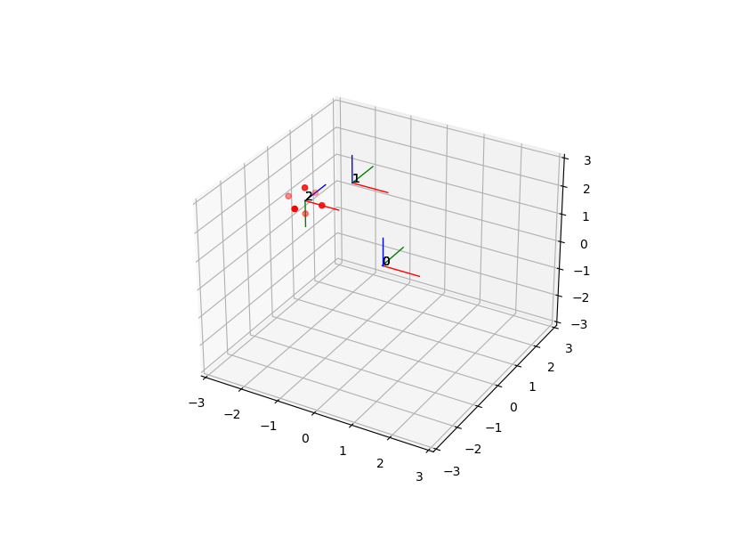

# Lab 11

This lab 

## Problem 1

There are 8 subtasks of this task

https://github.com/kciebiera/zad_11_delete_later/blob/234e9cd36e6215b0c9fb558fa6e3bd402c51baa1/task_1.py#L1-L66

`task_1.py` program can generate eight different plots. For instance `task_1.py 3`:


Plots show base coordinate frame (dashed lines) and transformed frames (solid lines). You can zoom in, zoom out and so. Colors used
are red - X, green - Y, blue - Z.

For every of eight plots find a (4x4) transformation from base to transformed frames.

## Problem 2

Write a python program, that takes as an input:

1. Series of transformations from base frame to end effector frame described by (4x4) matrices.
2. Point cloud with respect to end effector frame (for instance this is a ball of radius 1 $x^2 + y^2 + z^2 <= 1$).

and produces a matplotlib 3D plot containing:

1. All frames 
2. Transformed point cloud

For two matrices:

```
[[1, 0, 0, 0], [0, 1, 0, 0], [0, 0, 1, 0], [0, 0, 0, 1]]
[[ 2.22044605e-16 -1.00000000e+00  0.00000000e+00  0.00000000e+00]
 [ 1.00000000e+00  2.22044605e-16  0.00000000e+00  0.00000000e+00]
 [ 0.00000000e+00  0.00000000e+00  1.00000000e+00  0.00000000e+00]
 [ 0.00000000e+00  0.00000000e+00  0.00000000e+00  1.00000000e+00]]
```

and point cloud
```
[[ 0.5  0.   0. ]
 [-0.5  0.   0. ]
 [ 0.   0.5  0. ]
 [ 0.  -0.5  0. ]
 [ 0.   0.   0.5]
 [ 0.   0.  -0.5]]
```

Output can be:



## Problem 3

### Task 3-1

Robot has two joints. First joint is revolute, second joint is prismatic with $d >= 0$. Robot base is located at $(0,0,0)$.
Joints are connected by a link of length $1$.
Second joint is rotated around $𝑍$ axis by 90 degrees as in an image below:


When  $𝜃_0=0$ and $𝑑_1=1$ location of end effector wrt base is  (0,1,1) 

Find:

1. Forward kinematics transformation of end effector
2. Workspace of the robot (set of points achievable by end-effector).
3. Inverse kinematics equation in a closed form
4. Write in python program implementing steps 1 and 3.


### Task 3-2

Robot has two prismatic joints with $𝑑 >= 0$. Robot base is located at $(0,0,0)$.
Joints are connected by a link of length 1. Second joint is rotated around $𝑋$ axis by 90 degrees as in an image below:


When $𝑑_0=1$ and  $𝑑_1=1$ location of end effector wrt base is  (0,1,2) 

Find:

1. Forward kinematics transformation of end effector
2. Workspace of the robot (set of points achievable by end-effector).
3. Inverse kinematics equation in a closed form
4. Write in python program implementing steps 1 and 3.
