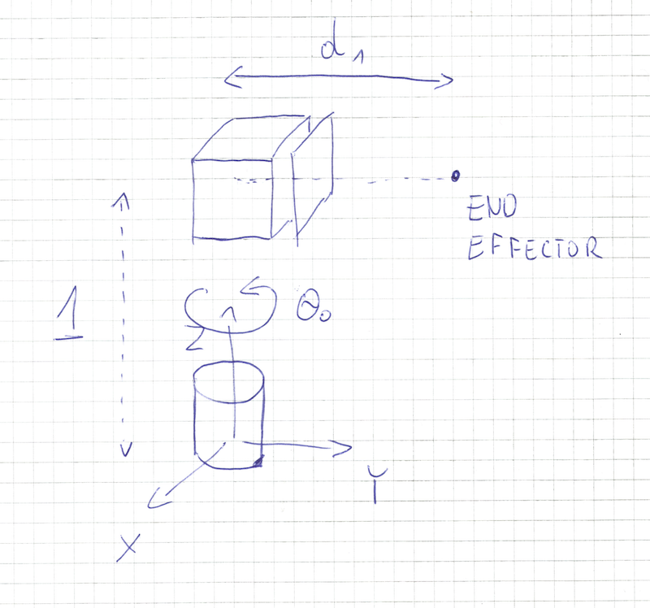

Robot has two joints. First joint is revolute, second joint is prismatic with  𝑑>=0 . Robot base is located at  (0,0,0) . Joints are connected by a link of length 1. Second joint is rotated around  𝑍  axis by 90 degrees as in an image below:
When  𝜃0=0  and  𝑑1=1  location of end effector wrt base is  (0,1,1) 
Find:

1. Forward kinematics transformation of end effector
2. Workspace of the robot (set of points achievable by end-effector).
3. Inverse kinematics equation in a closed form
4. Write in python program implementing steps 2 and 4.

